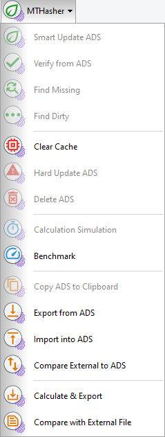
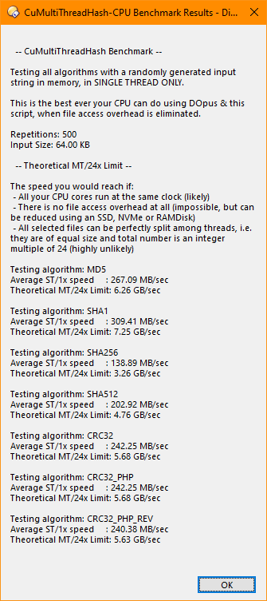
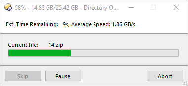
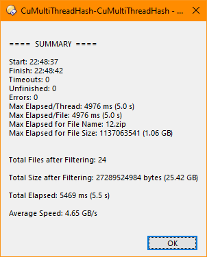

# Cü's MultiThreadHash
CuMTH or simply MTH is a user script for multi-threaded hashing for the brilliant, very powerful file manager [Directory Opus](https://gpsoft.com.au/) (often called DOpus or DO from here on), using its builtin hashing methods &amp; NTFS ADS.

## DO NOT USE THIS SCRIPT YET, IT IS NOT READY FOR ENDUSERS

## FEATURES:

* **Multi-threaded hashing**, defaults to all available cores on your machine.
* **Seamless integration into DOpus**:
  * Any number of files and folders can be selected and then hashed, verified, exported, etc.
  * File modification date is kept as before when you add/remove ADS data.
  * Action results, e.g. verification errors, files with missing or dirty (outdated) ADS, etc. are put into separate collections for further review.
  * Caching of ADS data in memory.
  * Progress bar with Pause & Abort support.
  * 15 pre-created buttons with multiple examples and nice-looking icons.
  * 5 helper columns/script fields: *Available*, *Dirty* (showing what has changed: date and/or size), *Dirty* (simple), *Formatted ADS* data to use in Infotips, *Raw ADS* data.
  * Unicode characters are not corrupted when exported from or imported into ADS.
  * Configurable number of threads and maximum wait time.
  * Auto-detection of checksum files if only 1 file is selected and one of the import/verify buttons is used.
* NTFS **ADS integration**, through and through.
* **External checksum files support** for .md5 & .sha1, incl. on-the-fly export & verification without using ADS. Another JSON-based, specific to this script is also supported, which contains very detailed information.
* **Long filename & path support** (> 255 chars).
* Simple CPU **benchmarking**.
* **Automatic HDD drive detection** (vs SSD, NVMe...) - CuMTH can reduce number of threads to avoid disk thrashing.
* **Extremely fast**, in fact faster than most native hashing programs, even all of the few multi-threaded programs except one [*]. Although this JScript, the heavy work is done by DOpus, this script simply optimizes how it is done.
* **Less CPU usage** than single- or multi-threaded programs.
* Is not limited to the (currently 7) hashing algorithms supported by DOpus. **Extensible via external CLI hashing programs**, e.g. fsum, rhash, fastsum, fciv, blake3, etc. I included a few as example, incl. blake3, rhash.
* **Detailed file information** in exported checksum files, e.g. number of total, successful, skipped or failed files and their sizes, earliest/latest file dates, smallest/largest files, snapshot date&time in multiple formats. Exported filenames can be generated with the latest file's timestamp. These can be suppressed but are computed anyway.

[*] [CHK by Ilya Muravyov](http://compressme.net/) is a real piece of art when it comes to speed. It is the fastest hasher out there, bar none. Beats this script from 10% up to 40%, and other programs by at least 300, 400%. Excellent, excellent job Ilya! ...But unfortunately its speed advantage is overshadowed by its very spartan UI and usability. It is not automation-capable, e.g. with CLI parameters. It's not even possible to abort an operation. And good luck with re-verifying your files with the checksum files you just created. Yes, it can hash a directory but not verify it again (tested with latest v3.21). If you're fine with its UI and care only for the highest hashing speed possible, use CHK instead.

Speed-wise other multi-threaded programs like [ExactFile/exf](https://www.exactfile.com/), let alone single-threaded programs are nowhere near of CuMTH. With many CPU cores and fast SSD/NVMe, you can easily reach hashing-speeds upwards of 1.5 GB/sec; on a RAMDisk I achieved 4.8 GB/sec under near-perfect conditions. You can test the capabilities of your CPU using the incl. benchmark command.

## Why is SHA1 the default?

**The goal is file integrity check, first and foremost.**

Currently there will be only 1 algorithm: SHA1. DOpus' internal "sha256" & "sha512" seem to have [a bug and both calculate wrong results for files >=512 MB](https://resource.dopus.com/t/column-sha-256-and-sha-512/33525/6), that leaves: "md5", "sha1", "crc32", "crc32_php", and "crc32_php_rev" and I decided to go with SHA1 as a compromise *temporarily* because it's very fast & reasonably secure, between fast and insecure MD5 and slow and secure SHA256/SHA512.

Before you start "*but SHA1 is broken...*" No, it is not broken, at least not for any practical purpose or for purposes of this script. Yes, SHA1 is known to have collisions but an attack requires malicious & very time-consuming preparation of tampered data, which is never ever the case for files on your disk, even 1 bit corruption in a file will result in a different hash even if you use MD5.

The goal here is to quickly verify file integrity of your own files, not build military grade infrastructure or use these algorithms for web site security, etc. If you are concerned that the files under your control might be tampered with by external agents and could have the same hash checksum as previously, then this script is not what you're looking for.

As soon as DOpus fixes the bug mentioned above, you can anyway switch to SHA-256/512 if you like.

## Why ADS? Why not classical checksum files?

*Short answer: Because they're static, become quickly obsolete and have a large overhead.*

When you create hash checksum files of large folders with typical programs these files contain all the files, just as you requested, and their hashes. These files act as a snapshot. If you are not planning to make any changes in this folder, you can use the checksum file over and over. You can still use this script, as it includes full support for external checksum files and more, too.

However, if or when you add or remove files from these folders, these files slowly become obsolete and deviate from the checksum you have created. If you use the old checksum file over and over, you will get increasing number of errors. If you create a new checksum file after each change in the folder, you will lose track of which files might have been corrupted.

You might think "But why would I want to add/remove files from a secure 'archive' directory?" Say, you have a partition or an external disk where you keep copies of your projects, pictures, install files, whatever. If you're planning to use a single checksum file in the root folder or put a separate checksum file in each folder, be my guest.

If you use ADS, however, you can **attach the hash checksum to each file**; the overhead is very small, only ~150 bytes per file. **The stored information is file's last known modification date & size and its hash value.** Different algorithms are kept separate from each other via ADS name, e.g. SHA1 in <filename>:MTH_SHA1,  MD5 in <filename>:MTH_MD5 and so on. Some programs try to achieve this putting hashes into the filenames, but that's a crude & ugly method. With ADS you can quickly identify changed files and still validate the unchanged files, since each hash is directly attached to the file and contains its size and date at the time of hashing, instead of in static snapshots. And you can select and verify any number of files, you do not need a checksum file containing each of these files. **That's where the real power of this script and integration into a file manager starts to shine.** Where's the catch? ADS work only in NTFS. If you are still not convinced, you can always use checksum files; in fact, once you have the hashes in ADS, you can export a checksum file in almost zero time to a checksum file, too.

Another benefit is, the file's last modification timestamp & last known size is stored in ADS at the time of hashing. This helps to quickly identify changed files, since you have last updated the ADS hashes WITHOUT re-checking every single file, simply activate one of 'Dirty' or 'Dirty Verbose' columns and you will see. If the file size or date changes, it is almost impossible that the hash will not change unless some super genius agent manipulates your files and/or manipulates the ADS as well. So these files can be quickly identified in isolation, incl. what is changed: date, size or both. If you export ADS hashes, the script will warn you automatically that some files have no or outdates hashes.

You can also import existing .sha1, .md5 or this script's own .json format checksum files into ADS and remove the dependency to external files. The imported checksums will not be verified during import, but you can verify them very easily and compare freshly calculated data vs the data you just imported.

Yet another benefit is, apart from the extraordinarily fast multi-threading (fast af, if I may say so), if you are often synchronizing large amounts of files between computers, you can easily export the existing ADS data without re-calculation, and easily verify on the other computer, with this script or any other typical checksum programs, .md5 and .sha1 formats are fully supported. Verifying the hashes on the target machine will be usually much faster than binary comparison over network.

Although currently **only 1 single algorithm at a time** is supported in the script (I see no benefit in using multiple), the ADS streams for multiple streams are completely independent of each other, i.e. SHA1 hashes are stored in a different stream than SHA256, MD5, etc. hashes. Use whichever algorithm suits your needs best. I might implement multiple algorithms if enough interest is there.

**Bottom line is:**
Once you get used to the integration of extremely fast hashing and an excellent file manager, you will not miss classical hashing programs ;)

### ADS Overhead:

For SHA1 hashes the amount of data is typically around 150-160 bytes. This information is NOT allocated in a separate cluster than the main file's own, i.e. if your cluster size is 4096 bytes, a 1 byte file plus 160 bytes ADS will still allocate only 4096 bytes, not 8192.

### Recommended:

- Generated files are UTF8 without BOM by default
If you use DOpus text viewer plugin, activate '***Assume UTF-8 without BOM***' in its settings to view non-ASCII chars correctly.
- Activating the DOpus option '***File Operations -> Copy Attributes -> Copy all NTFS data streams***' is highly recommended.
- If you are using WinRAR you can activate '***Advanced -> Save file streams***' in archiving dialog and save it in your default profile as well. This will carry ADS hashes around.
Unfortunately 7-Zip or DOpus created archives do NOT support this.
- DO NOT USE EXACTFILE, EVER!
To my **absolute HORROR** I found out that ExactFile occasionally computes hashes incorrectly (tested with SHA1 only), because I was using it a lot. it does so only sporadically, which makes the situation even worse imo. When ExactFile hashes completely identical files in multi-threading the generated checksum file states: this 1 file has a different hash than the others, and when you repeat the hashing it shows the computes the correct hash again.
Completely unacceptable!

## Design Principles of This Script

- Wherever relevant, file size is preferred over file count.
- Original files are never ever touched, only its ADS streams.
- Tries to replace existing hashing programs, by integrating the functionality into a full-fledged file manager but it can easily be extended with external apps to utilize non-DOpus hashing algorithms, too
- Speed! Speed! Speed! Tries to maximize of CPU usage if possible, not to let it sit idly.
- Prefers NTFS ADS over external filelists with hashes, but external checksum files are fully supported as well.

When you look at the code, you will see some non-typical, i.e. not state-of-the-art JavaScript. This has 2 reasons:
1. I'm an ok but not the most seasoned JS programmer, JS is not my primary language.
2. This not ES5 or newer, but JScript, which roughly [corresponds to JS 1.5/ES3](https://johnresig.com/blog/versions-of-javascript/)!
3. This is not a browser environment and due to only available method to us for multi-threading,
i.e. fire-and-forget, we cannot pass callback functions, etc. and must communicate via
DOpus variables only.
4. Debugging DOpus user scripts without an IDE or browser support as devs usually have when developing JavaScript is a major PITA! DOpus developers probably never had such large scripts in mind when they introduced user scripts, so I cannot blame them at all. Nevertheless, because of the lack of a debugger some ugly stuff had to be done.

## Screenshots

Buttons

Benchmark results on an AMD 3900x (12 cores, 24 threads

Hashing Progress

Summary

...more to come
